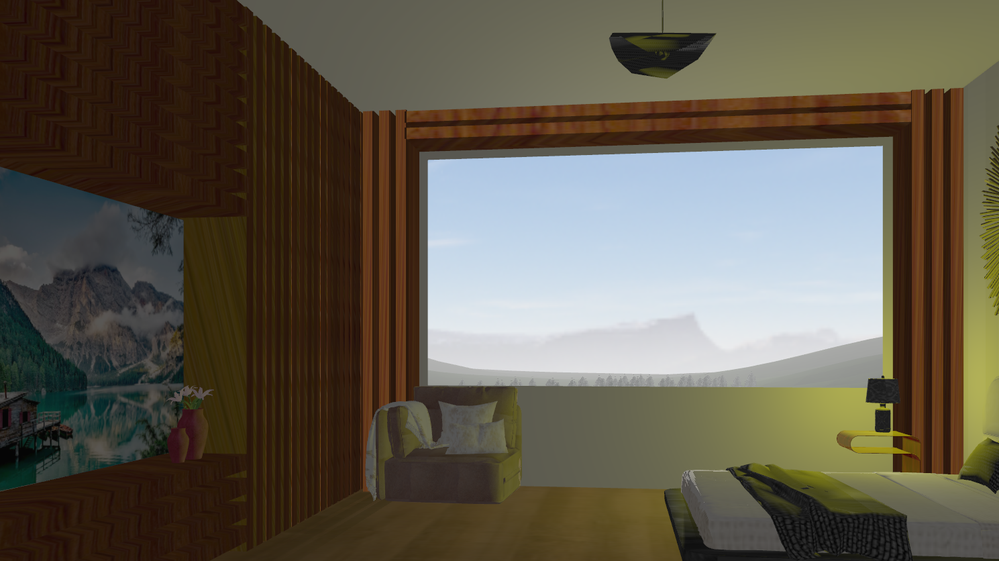
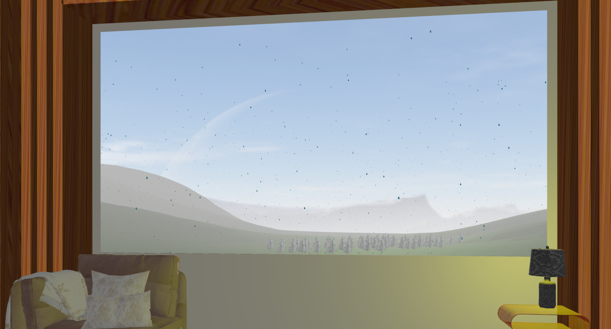
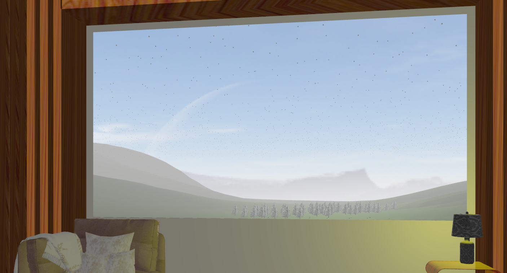
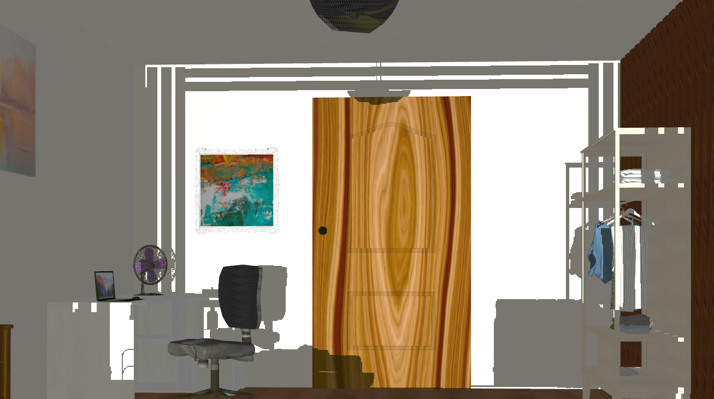
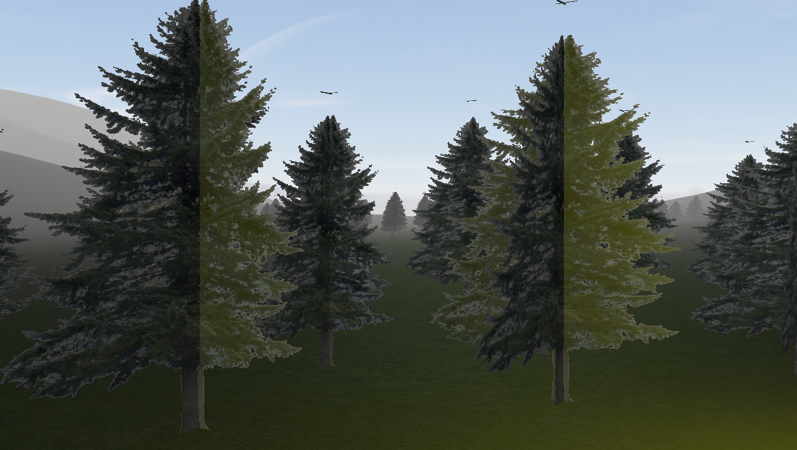
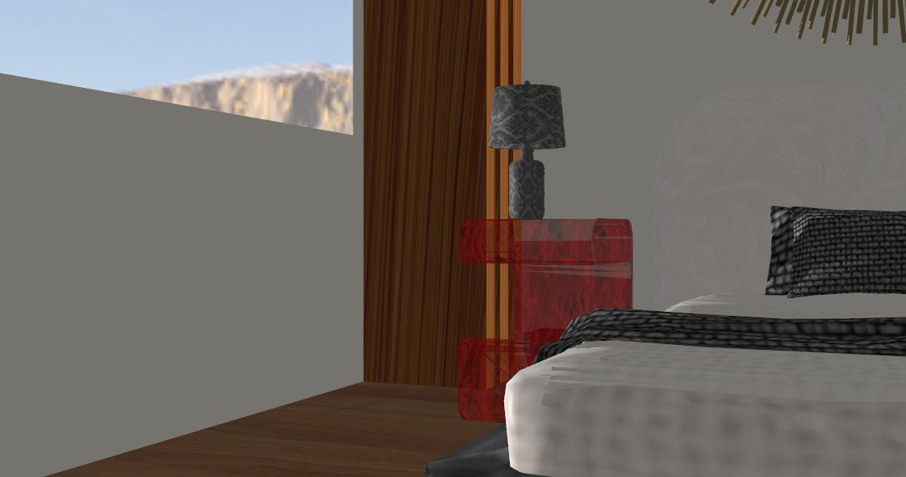
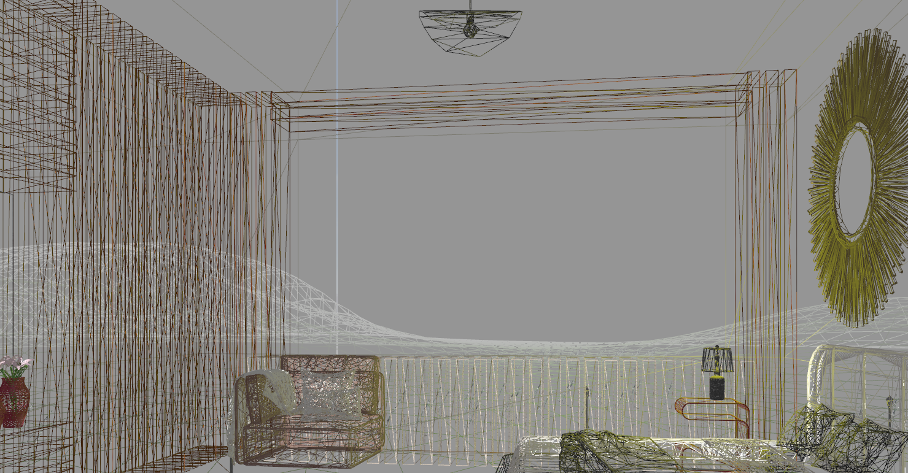
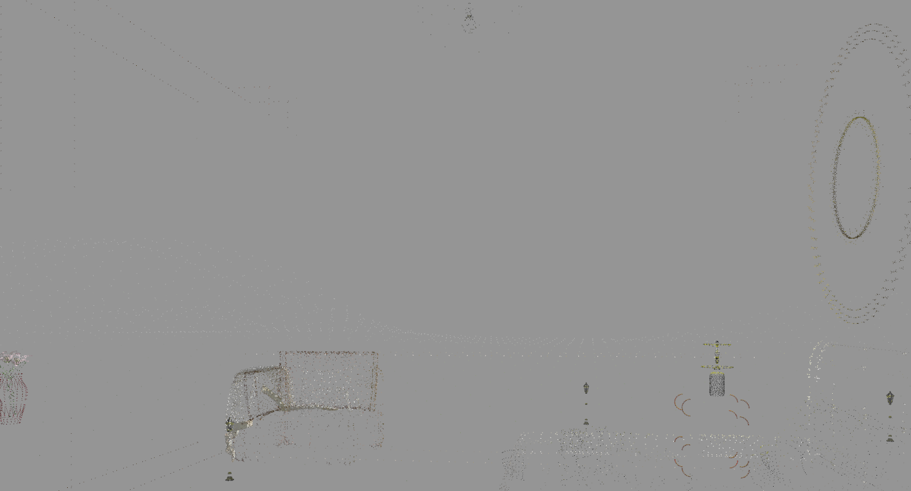

# 🎨 Graphics Processing Project  

---

## 🎯 Project Overview  
This project aims to render an interactive scene as realistically as possible.  
- **Blender** is used for **modeling** objects with a decent level of detail.  
- **OpenGL** handles **exporting** objects and adding effects such as **lighting, shadows, rain, animations, etc.**  
- Advanced programming techniques leverage **CPU-GPU interaction** for optimized rendering.  

---

## 🌍 Scene & Functionalities  

### **🏡 Scene Description**  
The scene consists of two main areas:  
1. **A bedroom** with various objects to enhance realism and authenticity.  
2. **An outdoor landscape** with rolling hills, trees, and streetlights visible through the bedroom window.  

### **⚙️ Functionalities**  
- **Navigation** through the scene using the **keyboard and mouse**  
- **Animated scene presentation**  
- **Global & local lighting** effects  
- **Toggle lighting sources** from the keyboard  
- **Fog, rain, and snow effects**  
- **Realistic shadow generation**  
- **Object animations (e.g., rotating fan blades)**  
- **Fragment discarding for rendering trees without backgrounds**  
- **Transparency rendering for glass-like objects**  
- **Different visualization modes:** **wireframe** and **point mode**  

---

## 🛠 Implementation Details  

### **🎮 Navigation System**  
- Implemented in **Camera.cpp**  
- Supports **forward, backward, up, down movements**  
- Uses **pitch and yaw angles** for horizontal and vertical rotations  
- Middle mouse button allows **smooth camera rotation**  

### **🎞️ Scene Animation**  
- Controlled via **GLFW time functions**  
- First animation: **Camera rotates over the outdoor terrain**  
- Second animation: **Camera follows pre-defined points inside the bedroom**  

### **💡 Lighting System**  
- **Global lighting:** Simulated **sunlight** using **directional light**  
- **Local lighting:** Uses **point light sources**  
- **Three lighting components:** **Ambient, Diffuse, Specular**  
- **Toggle lights dynamically using keyboard input**
  
  

### **🌧️ Weather Effects (Fog, Rain, Snow)**  
- **Fog:** Uses an **exponential quadratic formula** for blending objects with gray tones  
- **Rain:** **Randomly generated raindrops** fall from a fixed height and reset upon reaching the ground
    
- **Snow:** Uses **spiral movement** for realistic snowfall
  

### **🔳 Shadow Mapping**  
- Uses **depth buffer comparisons** to determine shadow areas  
- Supports **directional light shadows**  
- Future improvement: **Add shadows for point lights**
  

### **🚀 Advanced Rendering Techniques**  
- **Fragment discarding** for trees (removes unwanted background pixels)
  
- **Transparency rendering** with custom shaders
  
- **Multiple rendering modes:** **wireframe, point mode**
  
  

---

## 🎮 User Interface & Controls  

| **Key** | **Action** |
|---------|-----------|
| `W` | Move Forward |
| `S` | Move Backward |
| `A` | Move Left |
| `D` | Move Right |
| `Q` | Move Up |
| `E` | Move Down |
| `Z` | Rotate Left |
| `X` | Rotate Right |
| `C` | Rotate Up |
| `V` | Rotate Down |
| `R` | Toggle Wireframe Mode |
| `T` | Toggle Point Mode |
| `1` | Play/Pause Animation 1 |
| `2` | Play/Pause Animation 2 |
| `3` | Toggle Fan Rotation |
| `4` | Toggle Rain Effect |
| `5` | Toggle Snow Effect |
| `0` | Toggle Directional Light |
| `9` | Toggle Point Lights |
| `M` | Show/Hide Shadow Map |
| `J` | Rotate Directional Light Left |
| `L` | Rotate Directional Light Right |

---

## 📌 Conclusions & Future Improvements  
Although the scene achieves a good level of realism, there are still improvements that can be made:  
✅ **Add shadows for point lights** (requires perspective projection)  
✅ **Increase object count** in the outdoor environment for enhanced realism  
✅ **Add more dynamic objects** for increased scene interactivity  
✅ **Optimize rendering performance** using **OpenGL programmable pipeline**  

---

## 📖 References  
- **Lab resources** from Moodle  
- [OpenGL Dev Tutorials](https://www.ogldev.org/www/tutorial20/tutorial20.html)  
- [Learn OpenGL](https://learnopengl.com/Lighting/Multiple-lights)  

---

## 🚀 How to Run the Project  
```bash
git clone https://github.com/noemikulcsar/Graphics-Project.git
cd Graphics-Project
# Compile and run the project using your preferred OpenGL setup
